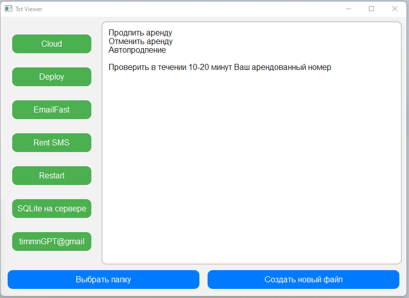

# Text File Manager

**Text File Manager** — это простое приложение на Python с использованием библиотеки PyQt6, которое позволяет удобно управлять текстовыми файлами в выбранной папке. 

---

## Возможности:
- Выбор папки для работы с текстовыми файлами.
- Автоматическое запоминание последнего выбранного пути.
- Сканирование папки на наличие `.txt` файлов.
- Отображение списка файлов в виде кнопок (светло-зеленые кнопки).
- Просмотр и редактирование содержимого текстовых файлов.
- Автоматическое сохранение изменений при закрытии программы.
- Создание новых текстовых файлов через диалоговое окно.
- Удобный и интуитивно понятный интерфейс.

---

## Требования:
- Python 3.8+
- PyQt6

---

## Установка:
1. Клонируйте репозиторий:
    ```bash
    git clone https://github.com/Timmn3/text-file-manager.git
    cd text-file-manager
    ```
2. Установите зависимости:
    ```bash
    pip install PyQt6
    ```
3. Запустите приложение:
    ```bash
    python main.py
    ```

---

## Интерфейс программы:
*Скриншот интерфейса программы.*


---

## Лицензия:
Данный проект распространяется под лицензией [MIT License](LICENSE).
